# Model descriptions with links to download model weights
     

---

## SceneSeg
Self-driving cars are usually trained to detect specific object types, such as cars, pedestrians, buses, etc. Such approaches are prone to failure cases when a self-driving car encounters an unusual object that it hasn't seen before, e.g. a rickshaw, or if a self-driving car encounters a strange presentation of a known object, e.g. a cyclist that has fallen over. In these scenarios, self-driving cars are unable to detect these critical objects leading to dangerous driving outcomes. To address this, we have developed SceneSeg, a neural network that is able to segment all important foreground objects, irrespective of what that object is. SceneSeg is able to implicitly learn the visual features of foreground objects such as cars, buses, vans, pedestrians, cyclists, animals, rickshaws, trucks and other similar objects, even though it has not been explicitly trained to detect these object types. SceneSeg is also able to detect objects that are outside of its training data, such as tyres rolling down a highway, or a loose trailer. SceneSeg can also detect objects in unusual presentations that it hasn't seen during training. SceneSeg performs robustly across challenging weather and lighting conditions, including during heavy rain, snow and low light driving. SceneSeg performs out of the box on roads across the world without any parameter tuning. SceneSeg provides self-driving cars with a core safety layer, helping to address 'long-tail' edge cases which plauge object-level detectors. SceneSeg is part of the [AutoSeg Foundation Model](../AutoSeg/README.md) which forms the core of the vision-pipeline of the [Autoware Privately Owned Vehicle Autonomous Highway Pilot System](..).

During training, SceneSeg estimates three semantic classes

- `Foreground Objects`
- `Background Elements`
- `Drivable Road Surface`

However, during inference, we only use the outputs from the **`Foreground Objects`** class.

## Watch the explainer video
Please click the video link to play - [***Video link***](https://drive.google.com/file/d/1riGlT3Ct-O1Y2C0DqxemwWS233dJrY7F/view?usp=sharing)

## SceneSeg model weights
### [Link to Download Pytorch Model Weights *.pth](https://drive.google.com/file/d/1vCZMdtd8ZbSyHn1LCZrbNKMK7PQvJHxj/view?usp=sharing)
### [Link to Download Traced Pytorch Model *.pt](https://drive.google.com/file/d/1G2pKrjEGLGY1ouQdNPh11N-5LlmDI7ES/view?usp=drive_link)
### [Link to Download ONNX FP32 Weights *.onnx](https://drive.google.com/file/d/1l-dniunvYyFKvLD7k16Png3AsVTuMl9f/view?usp=drive_link)
### [Link to Download ONNX INT8 Wights *.onnx](https://drive.google.com/file/d/1yAIsUukWKBsbIvoKVAabwwKPmSXRy24D/view?usp=drive_link)

## Performance Results
SceneSeg was trained on a diverse dataset comprised of multiple open-source datasets, including ACDC, MUSES, IDDAW, Mapillary Vistas and the Comma10K datset. These datasets provide challenging training data covering a wide range of countries, road types, lighting conditions and weather conditions. The BDD100K dataset was not used during training and served as a broad and diverse test set.

Mean Intersection Over Union (mIoU) scores are provided for both validation and test data. Validation results are provided for each of the datasets which comprise the complete validation set, alongside the results for the entire validation set, which are presented in the Cross Dataset column. Per-class mIoU scores are provided, alongside mIoU averaged across classes, as well as an Overall mIoU score which calculates the mIoU between the full multi-class prediction and multi-class ground truth.

### Validation Set Performance - mIoU Scores
|| Cross Dataset | Mapillary| MUSES | ACDC | IDDAW | Comma10K |
|--------|---------------|------------------|-------|------|-------|----------|
| Overall | **90.7** | 91.1 | 83.7 | 89.3 | 87.2 | **92.5** |
| Background Objects | **93.5** | 93.7 | 89.1 | 93.2 | 90.0 | **95.1** |
| Foreground Objects | **58.2** | **60.9** | 35.7 | 46.9 | 58.6 | 58.9 |
| Drivable Road Surface | **84.2** | 85.7 | 70.8 | 74.4 | 81.8 | **86.3** |
| Class Average | **78.6** | **80.1** | 65.2 | 71.5 | 76.8 | **80.1** |

### Test Set Performance - mIoU Scores
|| BDD100K |
|-|---------|
| Overall | **91.5** |
| Background Objects | **94.3** |
| Foreground Objects | **69.8** |
| Drivable Road Surface | **71.3** |
| Class Average | **78.5** |

### Inference Speed
Inference speed tests were performed on a laptop equipped with an RTX3060 Mobile Gaming GPU, and an AMD Ryzen 7 5800H CPU. The SceneSeg network comprises a total of 223.43 Billion Floating Point Operations.

#### FP32 Precision
At FP32 precision, SceneSeg achieved 18.1 Frames Per Second inference speed

#### FP16 Precision
At FP16 precision, SceneSeg achieved 26.7 Frames Per Second inference speed

---

## Scene3D
Depth estimation is an essential technology for safe operation of self-driving cars, especially in challenging edge case scenarios. By sensing depth, self-driving cars are able to detect important objects in the scene irrespective of their appearance. Scene3D is able process monocular camera images to produce high resolution depth maps with sharp object boundaries, visible on the leaves of trees, thin structures such as poles, and on the edges of foreground objects - helping self-driving cars understand the dynamic driving scene in real-time. Scene3D enables important downstream perception tasks such as foreground obstacle detection, and is robust to changes in object appearance, size, shape and type, addressing 'long-tail' edge case scenarios. The current release of Scene3D estimates per-pixel relative depth, indicating which objects are nearer vs further away from the camera. Scene3D is part of the [AutoSeg Foundation Model](https://github.com/autowarefoundation/autoware.privately-owned-vehicles/tree/main/AutoSeg) which forms the core of the vision-pipeline of the [Autoware Autonomous Highway Pilot System](https://github.com/autowarefoundation/autoware.privately-owned-vehicles/tree/main)

## Watch the explainer video
Please click the video link to play - [***Video link***](https://drive.google.com/file/d/19E57_ECVF3ImMGY8TNmg7dqixH1ej8MB/view?usp=drive_link)

## Scene3D model weights
### [Link to Download Pytorch Model Weights *.pth](https://drive.google.com/file/d/1MrKhfEkR0fVJt-SdZEc0QwjwVDumPf7B/view?usp=sharing)
### [Link to Download Traced Pytorch Model *.pt](https://drive.google.com/file/d/1-LO3j2YCvwxeNLzyLrnzEwalTrYUZgK0/view?usp=drive_link)
### [Link to Download ONNX FP32 Weights *.onnx](https://drive.google.com/file/d/19gMPt_1z4eujo4jm5XKuH-8eafh-wJC6/view?usp=drive_link)

## Performance Results
Scene3D was trained on a diverse dataset comprised of multiple open-source datasets, including Mapillary BDD100K, Mapillary Vistas, ROADWork, Comma10K, KITTI, DDAD, Driving Stereo, Indian Driving Dataset, Zenesact Open Dataset and the Mapillary Planet Scale Dataset. RGB images from these datasets were processed using DepthAnythingV2 VIT-Large model to create ground truth relative depth map pseudo labels - resulting in 488,535 total samples, of which 24,426 samples were set aside for validation. In essence, we perform a model distillation from DepthAnythingV2 Large, which employs a computationally heavy transformer architecture originally trained on 62 Million images, to a lightweight, convolutional neural network architecture which is real-time capable on edge hardware.

During training, Scene3D estimates a relative depth map which is compared with the ground truth pseudo labels from DepthAnything to calculate the network loss. We utilize 2 loss functions, a Scale Invariant Loss and an Edge Preservation Loss:

### Scale Invariant Loss
Multiple scale and scale shift invariant losses were tried, however, we found that the best results were achieved by applying min-max scaling to the predicted and ground truth depth pseudo label and then calcuating a robust mean absolute error (ignoring the top 10% of erroneous pixels as they were likely caused by errors in the ground truth pseudo labels)

### Edge Preservation Loss
In order to preserve sharp edges in the depth map, an edge preservation loss was applied which applies a 3x3 derivative kernel in x and y directions to calculate the edge gradients in the prediction and ground truth depth pseudo label and calculates the mean absolute error. To ensure smoothness and for regularization, this edge preservation loss was applied at multiple image scales (full-size, 1/2 , 1/4, 1/8). The final edge preservation loss was calculated as an average between the individual edge losses at multiple scales.

### Total Loss
The total loss is set to a weighted sum of the Scale Invariant Loss and Edge Preservation Loss to ensure both losses are of similar magnitude during training.

### Training Details
The network was trained in 2 stages, during the first stage the batch size was set to 24 and the learning rate was set to 1e-4. The best network from stage 1 (as measured on validation dataset results) was finetuned in stage 2 with a batch size of 3 and a learning rate of 1.25e-5. Heavy data augmentations were used to increase the network's robustness to noise and improve generalization. Furthermore, a random horiztonal grid-flip augmentation was applied in which the image was split in half and the left and right halves of the image were swapped. This resulted in variations of depth distributions for the scene and prevented the network from over-fitting to a front facing camera perspective. During the second stage of training, color and space augmentations were removed, and only a random horizontal flip augmentation was retained.

### Validation Set Performance - Loss
| Total Loss | Scale Invariant Loss | Edge Preservation Loss |
|------------|----------------------|------------------------|
| **0.08408** | 0.07004 | 0.01404 | 

### Further Observations
Typically, DepthAnything V2 model predictions suffer from flickering artefacts when run sequentially on frame-by-frame video predictions. In order to mitigate this, the authors introduced a new version of the model which adds Temporal Attention. We find however, that altough Scene3D was trained using depth pseudo labels from DepthAnything V2 without Temporal Attention, flickering artefacs are not present in Scene3D predictions. This is likely due to the fact that Scene3D is able to learn more gernalizable features which are domain specific (on-road driving data only) and capture more detailed context related to driving scenes. Furthermore, we do not apply a shift invariant loss, so it is also likely that Scene3D has learned starting road depth visible in the bottom of the image as an anchor for the depth of the scene.

### Inference Speed
Inference speed tests were performed on a laptop equipped with an RTX3060 Mobile Gaming GPU, and an AMD Ryzen 7 5800H CPU. The SceneSeg network comprises a total of 238.41 Billion Floating Point Operations.

#### FP32 Precision
At FP32 precision, Scene3D achieved 15.1 Frames Per Second inference speed

#### FP16 Precision
At FP16 precision, Scene3D achieved 23.9 Frames Per Second inference speed

---

## DomainSeg
Roadwork scenes and construction objects present a challenging edge-case scenario for self-driving cars. Roadwork objects can be placed dynamically and their position can be changed at a moments notice by construction workers. On many occassions, roadwork objects can be used to artifically narrow the driving corridor and guide vehicles to merge lanes. These scenarios are very demanding for self-driving cars, creating a need for a robust and reliable roadwork scene segmentation technology. DomainSeg addresses this key technology gap, delivering robust safety perception across urban driving scenarios, highways and even unstrcutured roads. It is able to adapt to challenging weather conditions such as snow and low-light, and is robust to edge cases such as detection of traffic cones that have been knocked over by other cars. DomainSeg is part of the [AutoSeg Foundation Model](../AutoSeg/README.md) which forms the core of the vision-pipeline of the [Autoware Privately Owned Vehicle Autonomous Highway Pilot System](..).

During training, DomainSeg estimates a binary segmentation mask with a probability of each pixel belonging to a single 'super-class' of **roadwork objects**

## Watch the explainer video
Please click the video link to play - [***Video link***](https://drive.google.com/file/d/1gB7lIsvwm-4PdDg2fjSEBH0nqW0rI-4W/view?usp=sharing)

## DomainSeg model weights
### [Link to Download Pytorch Model Weights *.pth](https://drive.google.com/file/d/1sYa2ltivJZEWMsTFZXAOaHK--Ovnadu2/view?usp=drive_link)
### [Link to Download Traced Pytorch Model *.pt](https://drive.google.com/file/d/12fLHpx3IZDglRJaDZT9kMhsV-f6ZTyks/view?usp=drive_link)
### [Link to Download ONNX FP32 Weights *.onnx](https://drive.google.com/file/d/1zCworKw4aQ9_hDBkHfj1-sXitAAebl5Y/view?usp=drive_link)

## Performance Results
DomainSeg was trained using the ROADWork dataset by Carnegie Mellon University, yielding 7.25K training samples and 150 validation samples.

Mean Intersection Over Union (mIoU) scores for DomainSeg on validation samples are below

### Validation Set Performance - mIoU Scores
| |Validation | 
|--------|----|
| mIoU | **46.6** | 

### Inference Speed
Inference speed tests were performed on a laptop equipped with an RTX3060 Mobile Gaming GPU, and an AMD Ryzen 7 5800H CPU. The SceneSeg network comprises a total of 223.43 Billion Floating Point Operations.

#### FP32 Precision
At FP32 precision, SceneSeg achieved 14.3 Frames Per Second inference speed

#### FP16 Precision
At FP16 precision, SceneSeg achieved 23.9 Frames Per Second inference speed

---

## AutoSpeed - closest in-path object detection

## AutoSpeed

Maintaining the vehicle speed and keep safe distance from the vehicle in front is crucial for safe driving. In order to
determine the closest inpath object AutoSpeed network is used. This network is inspired by YOLOv11 architecture, with
substituted c3K2 by a new block ASC block to improve CIPO object detection.

### Performance Results

Network is trained on [OpenLane](https://github.com/OpenDriveLab/OpenLane) dataset.

Network detection success rate is measured by the percentage of frames where the max IoU between the predicted and
ground-truth (GT) bounding boxes is above a certain threshold. For different groups of sequences are selected to measure
network detection success rate for different weather conditions

* Daytime Fair Weather
* Daytime Adverse Weather
* Nighttime Fair Weather
* Nighttime Adverse Weather

<table style="border:none; border-collapse:collapse;">
  <tr>
    <td>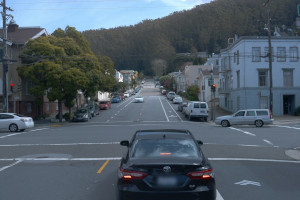</td>
    <td>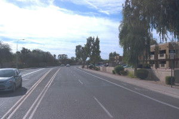</td>
    <td>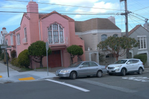</td>
  </tr>
</table>

<table>
  <tr>
    <th style="text-align:left;">Daytime, Fair Weather</th>
    <th colspan="3" style="text-align:center;">% frames with CIPO detection where prediction/ground truth maxIoU > threshold</th>
  </tr>
  <tr>
    <th style="text-align:left;">Sequence</th>
    <th >maxIoU &gt; 0.50</th>
    <th>maxIoU &gt; 0.75</th>
    <th>maxIoU &gt; 0.90</th>
  </tr>
  <tr>
    <td style="font-size:10px;">segment-17065833287841703_2980_000_3000_000_with_camera_labels</td>
    <td style="text-align:center;">100.00%</td>
    <td style="text-align:center;">100.00%</td>
    <td style="text-align:center;">98.99%</td>
  </tr>
  <tr>
    <td style="font-size:10px;">segment-346889320598157350_798_187_818_187_with_camera_labels</td>
    <td style="text-align:center;">95.98%</td>
    <td style="text-align:center;">88.44%</td>
    <td style="text-align:center;">70.35%</td>
  </tr>
 <tr>
    <td style="font-size:10px;">segment-902001779062034993_2880_000_2900_000_with_camera_labels</td>
    <td style="text-align:center;">93.94%</td>
    <td style="text-align:center;">92.42%</td>
    <td style="text-align:center;">89.90%</td>
  </tr>
</table>

<table style="border:none; border-collapse:collapse;">
  <tr>
    <td>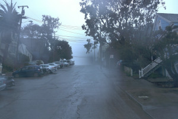</td>
    <td>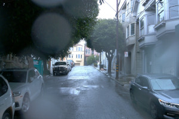</td>
    <td>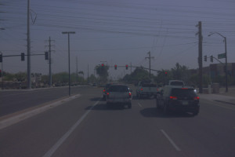</td>
  </tr>
</table>

<table>
  <tr>
    <th style="text-align:left;">Daytime, Adverse Weather</th>
    <th colspan="3" style="text-align:center;">% frames with CIPO detection where prediction/ground truth maxIoU > threshold</th>
  </tr>
  <tr>
    <th style="text-align:left;">Sequence</th>
    <th >maxIoU &gt; 0.50</th>
    <th>maxIoU &gt; 0.75</th>
    <th>maxIoU &gt; 0.90</th>
  </tr>
  <tr>
    <td style="font-size:10px;">segment-191862526745161106_1400_000_1420_000_with_camera_labels</td>
    <td style="text-align:center;">100.00%</td>
    <td style="text-align:center;">100.00%</td>
    <td style="text-align:center;">100.00%</td>
  </tr>
  <tr>
    <td style="font-size:10px;">segment-447576862407975570_4360_000_4380_000_with_camera_labels</td>
    <td style="text-align:center;">100.00%</td>
    <td style="text-align:center;">100.00%</td>
    <td style="text-align:center;">100.00%</td>
  </tr>
 <tr>
    <td style="font-size:10px;">segment-6183008573786657189_5414_000_5434_000_with_camera_labels</td>
    <td style="text-align:center;">100.00%</td>
    <td style="text-align:center;">100.00%</td>
    <td style="text-align:center;">95.48%</td>
  </tr>
</table>

<table style="border:none; border-collapse:collapse;">
  <tr>
    <td>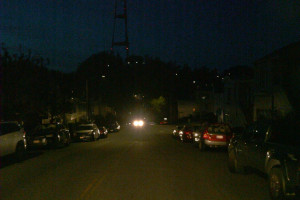</td>
    <td>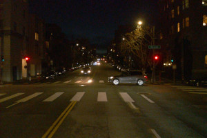</td>
    <td>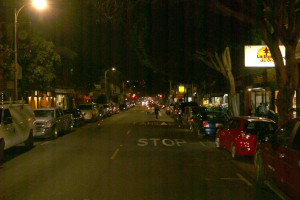</td>
  </tr>
</table>

<table>
  <tr>
    <th style="text-align:left;">Nighttime, Fair Weather</th>
    <th colspan="3" style="text-align:center;">% frames with CIPO detection where prediction/ground truth maxIoU > threshold</th>
  </tr>
  <tr>
    <th style="text-align:left;">Sequence</th>
    <th >maxIoU &gt; 0.50</th>
    <th>maxIoU &gt; 0.75</th>
    <th>maxIoU &gt; 0.90</th>
  </tr>
  <tr>
    <td style="font-size:10px;">segment-4426410228514970291_1620_000_1640_000_with_camera_labels</td>
    <td style="text-align:center;">100.00%</td>
    <td style="text-align:center;">100.00%</td>
    <td style="text-align:center;">100.00%</td>
  </tr>
  <tr>
    <td style="font-size:10px;">segment-5289247502039512990_2640_000_2660_000_with_camera_labels</td>
    <td style="text-align:center;">92.93%</td>
    <td style="text-align:center;">92.93%</td>
    <td style="text-align:center;">91.92%</td>
  </tr>
 <tr>
    <td style="font-size:10px;">segment-8679184381783013073_7740_000_7760_000_with_camera_labels</td>
    <td style="text-align:center;">87.37%</td>
    <td style="text-align:center;">65.15%</td>
    <td style="text-align:center;">0.00%</td>
  </tr>
</table>

<table style="border:none; border-collapse:collapse;">
  <tr>
    <td>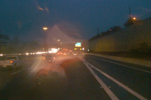</td>
    <td>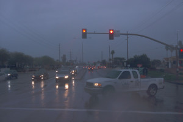</td>
    <td>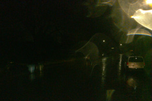</td>
  </tr>
</table>

<table>
  <tr>
    <th style="text-align:left;">Nighttime, Adverse Weather</th>
    <th colspan="3" style="text-align:center;">% frames with CIPO detection where prediction/ground truth maxIoU > threshold</th>
  </tr>
  <tr>
    <th style="text-align:left;">Sequence</th>
    <th >maxIoU &gt; 0.50</th>
    <th>maxIoU &gt; 0.75</th>
    <th>maxIoU &gt; 0.90</th>
  </tr>
  <tr>
    <td style="font-size:10px;">segment-6491418762940479413_6520_000_6540_000_with_camera_labels</td>
    <td style="text-align:center;">55.28%</td>
    <td style="text-align:center;">42.71%</td>
    <td style="text-align:center;">22.61%</td>
  </tr>
  <tr>
    <td style="font-size:10px;">segment-11356601648124485814_409_000_429_000_with_camera_labels</td>
    <td style="text-align:center;">100.00%</td>
    <td style="text-align:center;">90.95%</td>
    <td style="text-align:center;">43.72%</td>
  </tr>
 <tr>
    <td style="font-size:10px;">segment-11901761444769610243_556_000_576_000_with_camera_labels</td>
    <td style="text-align:center;">99.49%</td>
    <td style="text-align:center;">99.49%</td>
    <td style="text-align:center;">97.96%</td>
  </tr>
</table>

***Note:*** In some sequences detection success rate is 100%, but the reason is that these sequences do not have CIPO
object, and result in some sequences are low because some of the far away objects are not detected.

## AutoSpeed model weights
### [Link to Download Pytorch Model Weights *.pth](https://drive.google.com/file/d/1iD-LKf5wSuvf0F5OHVHH3znGEvSIS8LY/view?usp=drive_link)
### [Link to Download ONNX FP32 Weights *.onnx](https://drive.google.com/file/d/1Zhe8uXPbrPr8cvcwHkl1Hv0877HHbxbB/view?usp=drive_link)

---

## EgoLanes
EgoLanes is a neural network that processes raw image frames and performs real-time semantic segmentation of driving lanes in the image. It produces a three class segmentation output for the ego-left lane, the ego-right lane and all other lanes. It outputs lanes at 1/4 resolution of the input image size allowing for quick inference on low power embedded hardware. EgoLanes was trained with data from a variety of real-world datasets including TuSimple, OpenLane, CurveLanes, Jiqing, and ONCE3D Lane.

### Loss Function:

- Lane-level binary cross-entropy loss: This loss penalized the model in its individual class level predictions
- Edge preservation loss: This loss ensured the model was able to predict lane boundaries accurately

## EgoLanes model weights
### [Link to Download Pytorch Model Weights *.pth](https://drive.google.com/file/d/1Njo9EEc2tdU1ffo8AUQ9mjwuQ9CzSRPX/view?usp=sharing)
### [Link to Download ONNX FP32 Weights *.onnx](https://drive.google.com/file/d/1b4jAoH6363ggTgVU0b6URbFfcOL3-r1Q/view?usp=sharing)

---

# Lite Models – Lightweight Perception Variants

---

All Lite models share the same architectural foundation:

> **EfficientNet-B0/B1 encoder + DeepLabV3+ decoder + lightweight heads**

The models are optimized with reduced decoder configurations and lightweight heads to significantly decrease computational cost while preserving spatial resolution and deployment flexibility (dynamic input resolution supported).

SceneSegLite and Scene3DLite use an EfficientNet-B1 encoder, while EgoLanesLite uses an EfficientNet-B0 encoder to further reduce computational cost.

---

# SceneSegLite

SceneSegLite is a lightweight semantic segmentation network performing **Cityscapes-style semantic classification (19 standard classes)**.

The 19 classes are grouped into the following categories:

### Flat Surfaces
- Road  
- Sidewalk  

### Construction
- Building  
- Wall  
- Fence  

### Objects
- Pole  
- Traffic Light  
- Traffic Sign  

### Nature
- Vegetation  
- Terrain  

### Sky
- Sky  

### Humans
- Person  
- Rider  

### Vehicles
- Car  
- Truck  
- Bus  
- Train  
- Motorcycle  
- Bicycle  

---

## Inference performance – Embedded Inference – Jetson Orin Nano (8GB)

**Forward pass includes:** Host→Device (H2D) + Inference + Device→Host (D2H)

### SceneSeg vs SceneSegLite

### SceneSeg vs SceneSegLite

| Model         | GOPs | Backend        | Forward [ms] | FPS  |
|--------------|------|---------------|--------------|------|
| SceneSeg     | 224  | FP32 ONNX     | 159.6        | 6.3  |
| SceneSeg     | 224  | FP32 TensorRT | 98.1         | 10.2 |
| SceneSegLite | 7.82 | FP32 ONNX     | 43.5         | 23.0 |
| SceneSegLite | 7.82 | FP32 TensorRT | 23.9         | 41.8 |
| SceneSegLite | 7.82 | INT8 TensorRT | 11.4         | 87.6 |

---

## SceneSegLite model weights

### [Download PyTorch Weights (*.pth)](#)
### [Download ONNX FP32 (*.onnx)](#)
### [Download TensorRT FP32 (*.engine)](#)
### [Download TensorRT INT8 (*.engine)](#)

---

# Scene3DLite

Scene3DLite is a lightweight monocular **relative depth estimation** model distilled from large-scale transformer-based depth models (DepthAnythingV2 as in the original Scene3D) to a compact convolutional architecture.

It preserves:

- Edge sharpness  
- Relative depth ordering  
- Scale-consistent predictions  

while reducing computational overhead.

---

## Inference performance – Embedded Inference – Jetson Orin Nano (8GB)

**Forward pass includes:** H2D + Inference + D2H

### Scene3D vs Scene3DLite

### Scene3D vs Scene3DLite

| Model         | GOPs | Backend        | Forward [ms] | FPS  |
|--------------|------|---------------|--------------|------|
| Scene3D      | 224  | FP32 ONNX     | 168.4        | 5.9  |
| Scene3D      | 224  | FP32 TensorRT | 99.7         | 10.0 |
| Scene3DLite  | 7.78 | FP32 ONNX     | 41.0         | 24.4 |
| Scene3DLite  | 7.78 | FP32 TensorRT | 23.4         | 42.7 |
| Scene3DLite  | 7.78 | INT8 TensorRT | 10.9         | 91.4 |

---

## Scene3DLite model weights

### [Download PyTorch Weights (*.pth)](#)
### [Download ONNX FP32 (*.onnx)](#)
### [Download TensorRT FP32 (*.engine)](#)
### [Download TensorRT INT8 (*.engine)](#)

---

# EgoLanesLite

EgoLanesLite is a lightweight **three-class lane segmentation** network.

Classes:

- `Leftmost Lane`
- `Rightmost Lane`
- `Other Lanes`

The model's output maintain the same spatial resolution as the input, instead of the original EgoLanes model which outputs at 1/4 resolution. 

---

## Validation Performance (640×320 input)
To allow for a fair comparison against EgoLanes baseline, we report the metrics of the same model trained with output stride = 1/4, like EgoLanes.

| Dataset     | Metric | EgoLanes | EgoLanesLite (OS = 1/4) | EgoLanesLite (OS = 1) |
|------------|--------|----------|--------------|--------------|
| CurveLanes | mIoU   | 46.9     | 44.6         |   24.6    |
| TuSimple   | mIoU   | 43.6     | 51.4         |   24.0    |

---

## Inference performance – Embedded Inference – Jetson Orin Nano (8GB)

**Forward pass includes:** H2D + Inference + D2H

### EgoLanes vs EgoLanesLite

| Model         | GOPs | Backend        | Forward [ms] | FPS  |
|--------------|------|---------------|--------------|------|
| EgoLanes     | 119  | FP32 ONNX     | 94.9         | 10.5 |
| EgoLanes     | 119  | FP32 TensorRT | 48.8         | 20.5 |
| EgoLanesLite (OS = 1/4) | 4.85 | FP32 ONNX     | 38.1         | 26.2 |
| EgoLanesLite (OS = 1/4) | 4.85 | FP32 TensorRT | 21.5         | 46.6 |
| EgoLanesLite (OS = 1/4) | 4.85 | INT8 TensorRT | 10.2         | 98.5 |
| EgoLanesLite (OS = 1) | 6.10 | FP32 ONNX     | 26.7         | 37.4 |
| EgoLanesLite (OS = 1) | 6.10 | FP32 TensorRT | 15.3         | 65.3 |
| EgoLanesLite (OS = 1) | 6.10 | INT8 TensorRT | 9.6         | 104.3 |

As shown, EgoLanesLite with OS = 1 doubles the number of operations with respect to the model trained with OS = 1/4, however, its inference time (on Jetson Orin Nano) remains almost unchanged.

---

## EgoLanesLite model weights

### [Download PyTorch Weights (*.pth)](#)
### [Download ONNX FP32 (*.onnx)](#)
### [Download TensorRT FP32 (*.engine)](#)
### [Download TensorRT INT8 (*.engine)](#)

---

# Folder Descriptions

## data_utils
Helper classes and scripts related to checking data, benchmarking, and data loading

## exports
Code to perform model quantization and exports

## inference
Helper classes to run model inference

## model_components
Classes defining layers and structure for individual blocks making up models, as well as overall classes for full models

## training
Helper classes for training as well as main train scripts for models

## visualizations
Examples of running inference and creating visualization output for single image and video from model predictions

