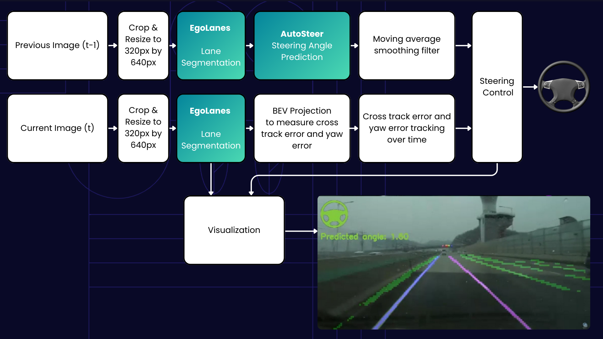

# Production Releases

## Download
The current release and past releases of VisionPilot can be downloaded from here: https://github.com/autowarefoundation/autoware.privately-owned-vehicles/releases

## Descriptions

### Vision Pilot 0.5
Vision Pilot 0.5 is an autonomous lateral steering system which processes images from a single front-facing camera for autonomous steering control features such as lane centering and lane-keep assist. Vision Pilot 0.5 has been tested with an automotive OEM on their private test track and the outputs of the system were compared with ground-truth data from human drivers. The system was able to achieve over 90% accuracy compared to human driven steering at highway driving speeds in high curvature turns (20+ degree steering angle) and high bank angles.

**System Architecture**

Vision Pilot 0.5 uses two neural networks, EgoLanes for segmenting and classifying lane lines, and AutoSteer for estimating the steering angle to follow the road. In parallel, a traditional tracking pipeline is utilized to measure the cross-track error and yaw error and a feedback plus feedforward controller is utilized to remain centered in-lane. The system can run headless or a visualzation can be shown which overlays the detected lanes and predicted steering angle on the input image. Although EgoLanes runs on each image individually, the AutoSteer network requires the current and previous images as input to capture spatio-temporal features. A moving average smoothing is applied to the output of AutoSteer to ensure that steering signal commands do not suffer from noise. Optionally, data can be logged and replayed using [rerun](https://rerun.io). The system supports both real-time camera feed and recorded MP4 videos as input, and simulation support is also available through the CARLA simulator. Under the hood, input images are converted to a GStreamer stream which is processed by VisionPilot. The entire Vision Pilot 0.5 system is packaged as a standalone C++ application without any middleware dependency, allowing for maximum configurability and ease of integration.