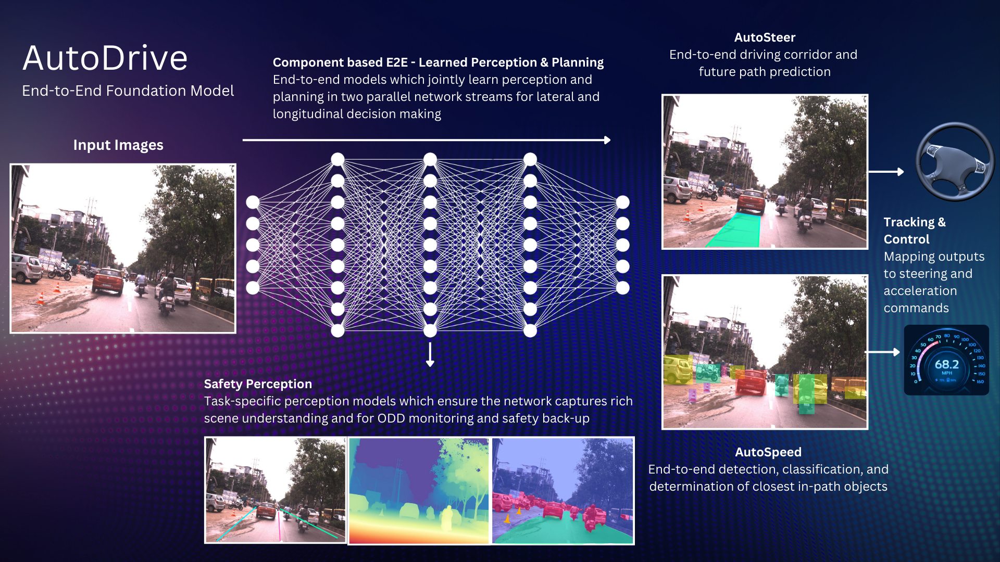
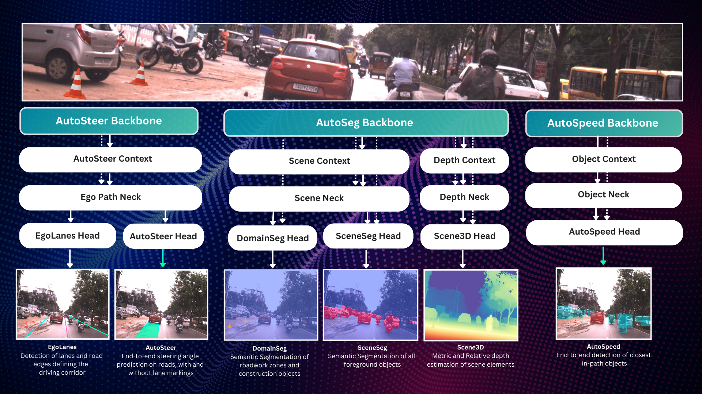

# Vision Pilot

Vision Pilot is a productionizable and safety certifiable fully open-source Level 2+ autonomous driving system designed for integration with automotive OEMs and Tier-1 suppliers in series production vehicles. It utilizes a single 8MP front-facing RGB camera with a 120 horizontal-degree FoV to enable both long-range and wide-angle sensing. Vision Pilot is designed to run in real-time on embedded edge hardware which can support 250 INT8 TOPs. It enables all standard Level 2+ driver assitance features as well as Highway Autopilot. 

### Middleware Recipes

VisionPilot supports multiple middleware options for Vision Pilot including IceOryx2, IceOryx, ZENOH, ROS2 as well as standalone. Vision Pilot is deployable on both QNX as well as Linux Ubuntu (tested with 22.04). The Middleware recipes folder contians example implementations of Vision Pilot for different middlewares.

### Production Releases

The Production Releases folder contains specific releases of Vision Pilot that enable production-level self-driving features.

## Architecture

Vision Pilot utilizes a component-based End-to-End autonomous driving architecture, wherein the entire autonomous driving stack is learnable. Vision Pilot also supports safety-perception neural networks which act as safety guardrails for the primary End-to-End stack. The overall End-to-End autonomous driving model which powers Vision Pilot is called AutoDrive, which is comprised of two End-to-End networks called AutoSteer for autonomous steering, AutoSpeed for autonomous acceleration/braking and Safety Perception models to address long-tail edge-case scenarios.

## AutoDrive Model

The AutoDrive model aims to utilize a shared backbone architecture with multiple stems and heads relying upon the same network weights. This helps improve model efficiency and forces the model to learn generalizable image features.

**More information about the specific models as well as examples showing how to try out and train the individual models in AutoDrive can be found in the [Models](../Models/) folder.**

### Backbone
We utilise EfficientNetB0 as a real-time capable, high performance backbone to act as a general purpose feature extractor. EfficientNetB0 provides a very good compromise between performance and accuracy amongst state-of-the art neural network backbones. The feature backbone has 4.07M Trainable Parameters

### Context
Convolutional neural networks are very good feature extractors, however, they have limited ability to capture the inter-relationships and shared context of image features. Transformers on the other hand, have limited capacity at capturing fine grained image features, but excell at capture overall scene context through multi-head self attention mechanisms. The context block aims to bridge the CNN/Transformer gap by capturing channel-wise feature relationships and creating a pesudo-attention matrix which is element-wise multiplied with the input features, accompanied by a residual skip connection. The context block has 9.20M Trainable Parameters

### Neck
The purpose of the neck is to aggregate and fuse multi-scale neural network features into a rich representation. The neck is the most critical neural network block in AutoSeg since all downstream tasks are derived from a single neck block. The neck block therefore needs to be able to capture salient and generalisable feature relationships to serve downstream tasks. A Link-Net style architecture is used to upsample lower-level neural network features and skip connections are added to the neck through 1D convolutions. 

## Shared Features
The Backbone, Context Block, and Neck are shared by the various output heads.

## Head
The head is designed to process rich contextual and scene features from the neck block and process them to create a useful output based on a specific downstream task such as semantic segmenation, depth estimation, or parameter estimation.