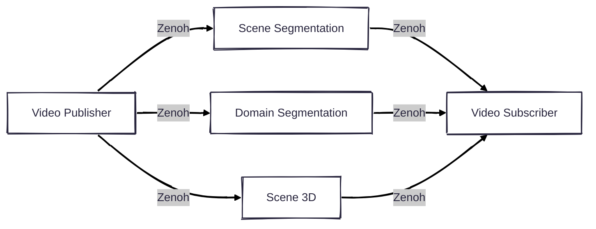

# VisionPilot Zenoh - Middleware Wrapper Layer

Zenoh is a performant protocol that can be used as a middleware of the AI pipeline.



## Supported Pipelines

### Segmentation

- **Scene Segmentation**: Binary foreground/background separation
- **Domain Segmentation**: Road/off-road classification  

### Depth Estimation

- **Scene 3D**: Monocular depth estimation

## Dependencies

- **OpenCV**: For image and video processing.
  - Ubuntu: `sudo apt install libopencv-dev`
- **Zenoh C library**: Required for the transportation.
  - Download from [the GitHub release](https://github.com/eclipse-zenoh/zenoh-c/releases)
  - You can also add the Eclipse repository for apt server.
  
    ```shell
    curl -L https://download.eclipse.org/zenoh/debian-repo/zenoh-public-key | sudo gpg --dearmor --yes --output /etc/apt/keyrings/zenoh-public-key.gpg
    echo "deb [signed-by=/etc/apt/keyrings/zenoh-public-key.gpg] https://download.eclipse.org/zenoh/debian-repo/ /" | sudo tee /etc/apt/sources.list.d/zenoh.list > /dev/null
    sudo apt update
    sudo apt install libzenohc-dev
    ```

- **CLI11**: Used for the command line interface.
  - Ubuntu: `sudo apt install libcli11-dev`

- **CUDA**: Optional for GPU processing.
- **OpenCV**: For image and video processing.
  - Ubuntu: `sudo apt install libopencv-dev`
- **ONNX Runtime**: For model inference.
  - Download from [the GitHub release](https://github.com/microsoft/onnxruntime/releases)
- **LibTorch**: For tensor manipulation capabilities.
  - Download from [the PyTorch website](https://pytorch.org/get-started/locally/)
